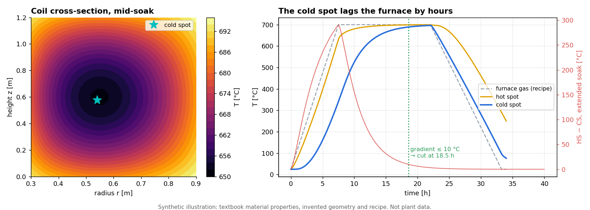
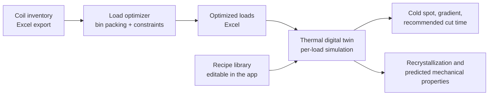
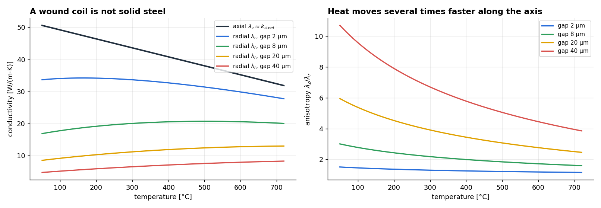

# Bell-Furnace Annealing: Load Optimizer and Thermal Digital Twin

**Two connected tools for batch annealing of cold-rolled steel coils.** The first decides which coils go into each furnace load; the second simulates how each load heats up inside the furnace, so the heating cycle can be ended when the slowest point of the load is actually done rather than when a fixed recipe says so.



> Built during my internship as a process trainee in cold-rolling operations at **Ternium** (Monterrey, 2026). Both tools were deployed and used in the plant.
>
> **This page is a high-level description only.** Source code, plant data, recipes, equipment drawings and calibration results are Ternium's and are not published. Every figure here was generated from scratch for this page using textbook material properties and invented geometry, and is labelled as such.

## The process

After cold rolling, steel coils have to be annealed to recover ductility. In a bell furnace, several coils are stacked on a base, covered with an inner cover full of protective gas, heated by an outer bell for many hours, then cooled. Two decisions drive the cost of every cycle:

1. **Which coils go together.** A load has a height limit, a weight limit, spacers between coils and compatibility rules (coils in one load share a thermal recipe). A poor grouping wastes furnace capacity and crane moves.
2. **When to stop heating.** The recipe is written for the worst case. The load is only done when its **cold spot**, the slowest point deep inside the coils, has reached temperature. That point cannot be measured: the thermocouple reads the base, not the coil interior.



## 1. Load optimizer

Grouping coils into loads is a **bin-packing problem** (NP-hard) with extra structure: height including spacers, total weight, outer-diameter compatibility between stacked coils, recipe and route compatibility, and the number of crane moves needed to dig each coil out of the storage yard.

- **Algorithms.** Greedy first-fit-decreasing as a baseline, improved with **simulated annealing** and **large-neighborhood search**, and a **best-load-first** heuristic with an exhaustive search over load density. An ILP formulation (OR-Tools / CBC) served as a reference to check how far from optimal the heuristics were.
- **Choosing an objective.** All methods reached the same minimum number of loads. What separated them was *where the leftover capacity ends up*. Best-load-first concentrates the slack into one large, reusable gap instead of spreading it thinly across every load. In practice that gap can be filled by the next production coils, so it was chosen as the default even though it scores the same on the textbook objective.
- **Delivery.** Two independent implementations, a Python desktop app and a single-file offline web app, cross-validated to give identical results on the same input.

## 2. Thermal digital twin

Given a load and its recipe, the simulator predicts the full temperature history of every coil. It works in two stages.

**Stage 1: a fast lumped model for the furnace.** Each coil is reduced to three concentric radial nodes, coupled by the exact steady conduction resistance of cylindrical shells. The protective gas is treated as a quasi-static enthalpy cascade along the stack, since its residence time is under a second. Convection uses standard correlations (Gnielinski through the bore, Churchill–Bernstein over the outside), and radiation is exact. This stage is cheap enough to run a whole campaign of loads.

**Stage 2: the actual heat equation inside each coil.** The axisymmetric, anisotropic conduction equation

```math
\rho c_p \frac{\partial T}{\partial t} = \frac{1}{r}\frac{\partial}{\partial r}\left(r\,\lambda_r \frac{\partial T}{\partial r}\right) + \frac{\partial}{\partial z}\left(\lambda_z \frac{\partial T}{\partial z}\right)
```

is solved by conservative finite volumes with Robin (convective and radiative) conditions on all four faces. Explicit time stepping stays inside the stability bound, and the scheme obeys a **discrete maximum principle**. That matters here because every output (cold spot, hot spot, gradient) is a minimum or maximum of the field, and a scheme that overshoots would bias exactly those numbers.

**The key physics: a coil is a laminate, not a solid.** A coil is hundreds of turns of strip separated by micrometre-scale gas gaps. Along the axis, heat flows through continuous steel. Across the turns, it has to cross every gap by gas conduction, radiation and asperity contact. Homogenizing that periodic structure gives a series (harmonic) mean in the radial direction:

```math
\lambda_r = \frac{d_s + d_g}{\dfrac{d_s}{k_s(T)} + \dfrac{d_g}{k_{gap}(T)}}, \qquad \lambda_z \approx k_s(T)
```



With realistic gaps, heat moves several times faster along the axis than across the turns. **That anisotropy is what creates a cold spot at all.** A model that treats the coil as solid steel predicts an almost uniform coil and misses the question entirely.

**The thermocouple as an observer.** The plant's control thermocouple does not sit in the coil. It is modelled as a first-order lag driven by a blend of metal and gas temperature, with its time constant and blend weight fitted to historical furnace charges. This connects the simulation to what operators see on their screen, without pretending the thermocouple measures the coil interior.

**From field to decision.** The gradient between hot spot and cold spot rises during the ramp, peaks, then relaxes during the soak. The recommended cut time is the first moment *after the peak* at which that gradient falls below a threshold. It is evaluated on a counterfactual run with the soak extended, so that cooling cannot make the criterion fire for the wrong reason.

**Metallurgy on top.** The simulated thermal history of the cold spot drives a JMAK recrystallization model and an empirical model for yield strength and elongation. Each load therefore gets a predicted property outcome as well as a cut time. The thermal model was calibrated and validated on held-out furnace charges before being used for decisions.

## What it was used for

- Building loads from the coil inventory with fewer wasted slots and fewer crane moves.
- Checking, load by load, whether a recipe was longer than the physics requires, and flagging loads where shortening it would put the cold spot at risk.
- Designing a plant trial matrix to test shorter cycles, with predicted properties for each trial coil.

## Honest limitations

- **The gap is the dominant uncertainty.** The inter-turn gap sets the radial conductivity, and therefore the cold spot. It cannot be measured directly and has to be inferred by calibration, so every downstream number inherits its uncertainty.
- **One-way coupling.** The 2-D coil field does not feed back into the gas energy balance of Stage 1, so the two stages do not conserve energy with each other. Stage 1 is the authority on timing and Stage 2 on the field.
- **Recrystallization kinetics are fitted, not measured.** The JMAK parameters were anchored to plant property data, and the pair of constants is correlated. The property predictions are best read as trends across loads, not as certified values.

## Stack

Python · NumPy · pandas · SciPy · Matplotlib · Tkinter (desktop apps, packaged as Windows executables) · JavaScript (offline web app) · OR-Tools · openpyxl · LaTeX (technical documentation)
